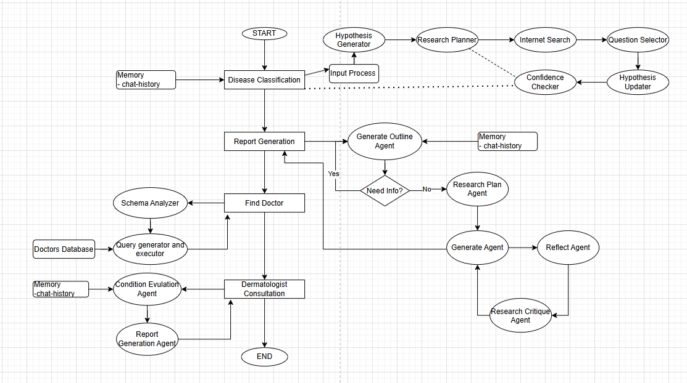
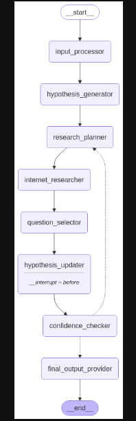
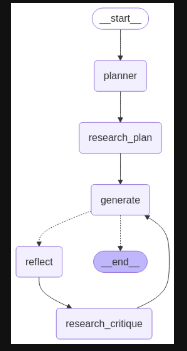
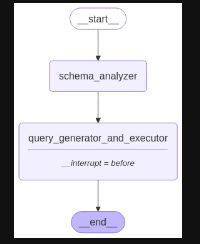

Okay, here is the consolidated documentation for the AI Dermatologist Assistant project.

---

# AI Dermatologist Assistant - Project Documentation

## 1. Introduction

The AI Dermatologist Assistant is a sophisticated application designed to assist users with dermatological concerns. Leveraging advanced AI techniques through LangGraph and LangChain, it offers functionalities ranging from preliminary skin condition classification based on user input (text/images) to generating detailed disease reports, finding relevant specialists, and summarizing consultations.

The system aims to provide informative support, acting as a preliminary resource before consulting a healthcare professional. It utilizes Large Language Models (LLMs) via `langchain-openai`, manages data persistence with `PostgreSQL` and `SQLAlchemy`, and exposes its functionalities through a web API (likely FastAPI, based on structure).

**Key Features:**

*   **AI-Powered Disease Classification:** Analyzes user-provided symptoms (text/image) and engages in clarifying dialogue to suggest potential skin conditions.
*   **In-Depth Report Generation:** Creates comprehensive reports on diagnosed conditions, covering causes, resistance patterns, and drawing from medical literature.
*   **Specialist Locator:** Helps users find suitable dermatologists based on location, the specific condition, and potentially other criteria.
*   **Consultation Summary:** Generates structured summaries (like SOAP notes) of the user's interaction with the assistant for easy reference.
*   **Persistent Chat History:** Maintains conversation context for coherent and efficient interactions using a PostgreSQL database.

## 2. Technology Stack

*   **Orchestration & AI Logic:** LangGraph, LangChain
*   **LLM Integration:** Langchain-OpenAI
*   **Database:** PostgreSQL
*   **ORM:** SQLAlchemy
*   **Web Framework (API):** FastAPI (inferred from structure and endpoint definitions)
*   **Containerization:** Docker, Docker Compose
*   **Search Augmentation:** Tavily API (inferred from `services/tavily.py`)
*   **Core Language:** Python

## 3. Project Structure

```
dermatology_assistant_project/
├── app/
│   ├── api/
│   │   ├── v1/
│   │   │   ├── chat.py
│   │   │   ├── disease_classification.py
│   │   │   ├── disease_report.py
│   │   │   ├── doctor_search.py
│   │   │   └── user.py
│   ├── auth/
│   │   └── auth.py
│   ├── core/
│   │   ├── config.py
│   │   └── database.py
│   ├── crud/
│   │   └── message_crud.py
│   ├── db/
│   │   ├── chat_history.py
│   │   ├── checkpointer.py
│   │   └── users.py
│   ├── graph/
│   │   ├── classification_nodes.py
│   │   ├── classification_workflow.py
│   │   ├── disease_report_nodes.py
│   │   ├── disease_report_workflow.py
│   │   ├── doctor_search_nodes.py
│   │   └── doctor_search_workflow.py
│   ├── models/
│   │   ├── chat_history.py
│   │   └── users.py
│   │   └── doctors.py
│   ├── prompts/
│   │   ├── disease_classification.py
│   │   ├── disease_report_prompts.py
│   │   └── doctor_search.py
│   ├── schemas/
│   │   ├── auth.py
│   │   ├── chat.py
│   │   ├── chat_history.py
│   │   ├── classification_state.py
│   │   ├── disease_report_state.py
│   │   ├── doctor_search_state.py
│   │   └── users.py
│   ├── services/
│   │   ├── llm.py
│   │   └── tavily.py
│   └── utils/
│       └── password.py
├── extra_codes/
│   └── create_doctor_table.py
├── notebooks/
│   ├── disease classification.ipynb
│   ├── Disease Report generation.ipynb
│   └── Search Doctor.ipynb
├── main.py
├── Dockerfile
├── docker-compose.yaml
└── requirements.txt

```

## 4. Core Workflows (LangGraph Implementation)

The application utilizes LangGraph to define multi-agent workflows for its core functionalities. Each workflow manages state (defined in `app/schemas/`) and orchestrates calls to LLMs, tools (like internet search via Tavily), and the PostgreSQL database. Persistence is handled via `app/db/checkpointer.py`.


### 4.1. 🧬 Disease Classification

*   **Objective:** Predict a potential skin condition based on user input (image/text) and follow-up questions, leveraging chat history for context.
*   **Implementation:** `app/graph/classification_workflow.py`, using nodes defined in `app/graph/classification_nodes.py` and state defined in `app/schemas/classification_state.py`.



* **Flow:**
    1.  **Input Processing:** Receives initial user input (symptoms, potentially images).
    2.  **Hypothesis Generation:** An agent (`Hypothesis Generator`) makes an initial assessment.
    3.  **Research Planning:** An agent (`Research Planner`) determines what information is needed to confirm or refute the hypothesis.
    4.  **Information Gathering:** Uses tools (`Internet Search`, likely via Tavily) and internal logic (`Question Selector`) to find external information or formulate clarifying questions for the user. Chat history (`Memory`, managed via `app/db/chat_history.py`) is consulted to avoid repetition.
    5.  **Confidence Check:** An agent (`Confidence Checker`) evaluates if the gathered information sufficiently supports a hypothesis.
    6.  **Hypothesis Update:** An agent (`Hypothesis Updater`) refines the prediction based on new data.
    7.  **Loop/Exit:** The process may loop back to research/questioning if confidence is low, or conclude with a potential classification. The state is persisted at each step.

### 4.2. 📄 Report Generation (Cause & Resistance)

*   **Objective:** Generate a detailed medical report on a diagnosed disease, focusing on its causes and resistance patterns.
*   **Implementation:** `app/graph/disease_report_workflow.py`, using nodes from `app/graph/disease_report_nodes.py` and state from `app/schemas/disease_report_state.py`.



* **Flow:**
    1.  **Outline Generation:** An agent (`Generate Outline Agent`) creates a report structure based on the prior classification result and chat history stored in the state.
    2.  **Information Need Assessment:** A decision node (`Need Info?`) checks if the existing information is sufficient for a comprehensive report.
    3.  **Research Loop (If Needed):**
        *   `Research Plan Agent`: Plans research steps.
        *   `Generate Agent`: Executes research (likely using search tools).
        *   `Reflect Agent`: Reviews the gathered information for quality and relevance.
        *   `Research Critique Agent`: Critiques the findings, potentially suggesting refinements or alternative search paths. This loop refines the information base within the graph's state.
    4.  **Report Finalization:** The outline is filled using the accumulated information, classification context, and chat history to produce a relevant, structured report.

### 4.3. 🧑‍⚕️ Find Doctor

*   **Objective:** Recommend suitable dermatologists based on user's location, diagnosed condition (from classification), and potentially availability.
*   **Implementation:** `app/graph/doctor_search_workflow.py`, nodes from `app/graph/doctor_search_nodes.py`, state from `app/schemas/doctor_search_state.py`.


* **Flow:**
    1.  **Schema Analysis:** An agent (`Schema Analyzer`) parses the user's request and workflow state (location, disease) to understand search parameters.
    2.  **Query Generation & Execution:** An agent (`Query Generator and Executor`) translates these parameters into searchable queries for the `doctors` table in the PostgreSQL database (via SQLAlchemy).
    3.  **Results:** The workflow returns a list of matching dermatologists retrieved from the database, including relevant details like contact information and potentially availability.

### 4.4. 🩺 Dermatologic Consultation (Summary) (Incomplete)

*   **Objective:** Analyze the complete user interaction (chat history) to generate a structured diagnostic summary, potentially formatted as a SOAP note.
*   **Implementation:** This might be a simpler LangChain chain or a dedicated function called by an API endpoint (e.g., within `app/api/v1/chat.py`), rather than a full LangGraph workflow. It heavily relies on reading from the `chat-history` table.
*   **Flow:**
    1.  **Condition Evaluation:** An agent or function (`Condition Evaluation Agent`) reviews the entire `chat history` associated with the user's specific `thread_id`.
    2.  **Report Generation:** An agent or function (`Report Generation Agent`) synthesizes the conversation flow, key findings (like classification results), and user inputs into a structured consultation report or summary.

## 5. Database Schema and Usage

The application relies on a PostgreSQL database managed via SQLAlchemy ORM to persist user data, conversation history, doctor information, and workflow states.

*   **Technology:** PostgreSQL, SQLAlchemy
*   **ORM Models:** Defined in `app/models/` (`users.py`, `chat_history.py`, likely `doctors.py`)
*   **Database Session Management:** Handled in `app/core/database.py`
*   **CRUD Operations:** Found in `app/crud/` and potentially within API route logic (`app/api/v1/user.py`).

### 5.1. Tables

1.  **`users` Table (`app/models/users.py`)**
    *   **Purpose:** Stores registered user information, including credentials for authentication.
    *   **Schema (`User` class):**
        *   `id`: PK, Integer
        *   `name`: String
        *   `username`: String, Indexed, Unique (likely)
        *   `email`: String, Indexed, Unique
        *   `phone`: String, Indexed, Unique
        *   `password`: String (Stores **hashed** password via `app/utils/password.py`)
    *   **Relationships:** One-to-many with `ChatHistory`.

2.  **`chat-history` Table (`app/models/chat_history.py`)**
    *   **Purpose:** Logs messages between users and the AI, keyed by user and conversation thread. Essential for LangGraph context and `checkpointer`.
    *   **Schema (`ChatHistory` class):**
        *   `id`: PK, Integer
        *   `user_id`: FK -> `users.id`, Integer, Not Null
        *   `thread_id`: Integer, Indexed, Not Null (Groups messages for a single workflow run)
        *   `message`: String (Message content)
        *   `message_type`: String (e.g., 'human', 'ai', 'system')
        *   `timestamp`: DateTime (with timezone), Defaults to `now()`
    *   **Relationships:** Many-to-one with `User`.

3.  **`doctors` Table (Defined in `app/models/doctors.py` or similar, setup via `extra_codes/create_doctor_table.py`)**
    *   **Purpose:** Stores dermatologist information for the "Find Doctor" feature.
    *   **Schema (`Doctor` class):**
        *   `id`: PK, Integer, Auto-increment
        *   `name`: String
        *   `division`: String
        *   `district`: String
        *   `chamber_location`: String
        *   `appoint_number`: String
        *   `appointment_day`: String
        *   `fee`: Integer

4.  **Checkpointer Table (Managed by LangGraph/SQLAlchemySaver)**
    *   **Purpose:** LangGraph's `SQLAlchemySaver` (configured in `app/db/checkpointer.py`) automatically creates and uses tables (often named like `checkpoints`, `writes`) to persist the serialized state (`app/schemas/*_state.py`) of active workflows, associated with a `thread_id`. This enables resuming conversations and fault tolerance.

## 6. Setup and Running the Application

Follow these steps to set up and run the AI Dermatologist Assistant locally using Docker:

1.  **Prerequisites:**
    *   Docker installed
    *   Docker Compose installed
    *   Git installed (for cloning)

2.  **Clone the Repository:**
    ```bash
    git clone <your-repository-url>
    cd dermatology_assistant_project
    ```

3.  **Configure Environment Variables:**
    *   Locate the `.env.example` file in the project root.
    *   Create a copy named `.env`:
        ```bash
        cp .env.example .env
        ```
    *   Edit the `.env` file and replace placeholder values with your actual secrets and configurations:
        *   `POSTGRES_USER`, `POSTGRES_PASSWORD`, `POSTGRES_DB`, `DATABASE_URL` (ensure consistency)
        *   `OPENAI_API_KEY`
        *   `TAVILY_API_KEY` (if used)
        *   `SECRET_KEY` (a long, random string for JWT/auth security)
        *   Any other relevant settings defined in `app/core/config.py`.

4.  **Build and Run with Docker Compose:**
    *   Open a terminal in the project root directory (where `docker-compose.yaml` is located).
    *   Run the following command:
        ```bash
        docker compose -f 'docker-compose.yaml' up -d --build
        ```
    *   **Explanation:**
        *   `docker compose -f 'docker-compose.yaml'`: Specifies the compose file.
        *   `up`: Creates and starts the containers (app, db).
        *   `-d`: Runs in detached mode (background).
        *   `--build`: Builds the application image using `Dockerfile` before starting.

5.  **Database Initialization/Migrations:**
    *   The application might use Alembic for migrations, or initial table creation might happen on startup based on SQLAlchemy models. Check `main.py` or startup logs.
    *   If the `doctors` table requires manual setup, you might need to execute the script:
        ```bash
        # Example: If the script connects using environment variables
        docker compose exec <app-service-name> python extra_codes/create_doctor_table.py
        # Replace <app-service-name> with the name of your application service in docker-compose.yaml (e.g., 'app', 'backend')
        ```

6.  **Accessing the Application:**
    *   The API should now be running. Check the `ports` mapping in `docker-compose.yaml` (e.g., `8000:8000`). Access it at `http://localhost:8000`.
    *   Interactive API documentation (Swagger UI) is typically available at `http://localhost:8000/docs`.
    *   ReDoc documentation is often at `http://localhost:8000/redoc`.

## 7. API Endpoints

The application exposes the following RESTful API endpoints, likely prefixed with `/api/v1/` or similar as defined in `main.py`. Authentication uses JWT Bearer tokens obtained via `/auth/login`.

### 7.1. Authentication (`/auth`)

*   **`POST /auth/login`**
    *   **Description:** Authenticates using `username` and `password` (sent as form data or JSON, check implementation). Returns JWT access token.
    *   **Request Body:** User credentials (e.g., `schemas.Auth.LoginRequest`).
    *   **Response:** Access token (e.g., `schemas.Auth.Token`).
*   **`GET /auth/me`**
    *   **Description:** Retrieves details of the user associated with the provided JWT token.
    *   **Authentication:** Required (Bearer Token).
    *   **Response:** Current user details (e.g., `schemas.User.UserResponse`).

### 7.2. User Management (`/user`)

*   **`POST /user/create/`**
    *   **Description:** Registers a new user.
    *   **Request Body:** New user data (e.g., `schemas.User.UserCreate`).
    *   **Response:** Created user details (e.g., `schemas.User.UserResponse`).
*   **`GET /user/read/`**
    *   **Description:** Retrieves a list of all users (potentially admin-only).
    *   **Authentication:** May be required.
    *   **Response:** List of user objects (e.g., `List[schemas.User.UserResponse]`).
*   **`GET /user/read/{user_id}`**
    *   **Description:** Fetches details for a specific user ID.
    *   **Authentication:** May be required (user fetching own info or admin).
    *   **Path Parameter:** `user_id` (integer).
    *   **Response:** Specific user details (e.g., `schemas.User.UserResponse`).
*   **`PUT /user/update/{user_id}`**
    *   **Description:** Updates a user's information. Users typically can only update their own profile.
    *   **Authentication:** Required (Bearer Token).
    *   **Path Parameter:** `user_id` (integer).
    *   **Request Body:** Fields to update (e.g., `schemas.User.UserUpdate`).
    *   **Response:** Updated user details (e.g., `schemas.User.UserResponse`).
*   **`DELETE /user/delete/{user_id}`**
    *   **Description:** Deletes a user account.
    *   **Authentication:** Required (Bearer Token - user deleting self or admin).
    *   **Path Parameter:** `user_id` (integer).
    *   **Response:** Confirmation message (e.g., `{"message": "User deleted successfully"}`).

### 7.3. Chat and Workflows (`/chat`)

*   **`POST /chat`** (If implemented for general LLM interaction outside specific workflows)
    *   **Description:** Send a message for a general AI response.
    *   **Authentication:** Required (Bearer Token).
    *   **Request Body:** User message, potentially `thread_id` (e.g., `schemas.Chat.ChatRequest`).
    *   **Response:** AI response (e.g., `schemas.Chat.ChatResponse`).
*   **`GET /chat/history`**
    *   **Description:** Retrieves message history for the authenticated user, potentially filtered by `thread_id`.
    *   **Authentication:** Required (Bearer Token).
    *   **Query Parameters:** Optional `thread_id` (integer).
    *   **Response:** List of chat history entries (e.g., `List[schemas.ChatHistory.ChatHistoryResponse]`).
*   **`POST /chat/classification`**
    *   **Description:** Starts or continues the Disease Classification LangGraph workflow. Manages state via `thread_id`.
    *   **Authentication:** Required (Bearer Token).
    *   **Request Body:** User input, `thread_id` (if continuing an existing session) (e.g., `schemas.Chat.WorkflowRequest`).
    *   **Response:** AI's next step (question, hypothesis, result), updated `thread_id` (e.g., `schemas.Chat.WorkflowResponse`).
*   **`POST /chat/disease-report`**
    *   **Description:** Starts the Disease Report Generation LangGraph workflow, usually requires context like a `thread_id` from a completed classification.
    *   **Authentication:** Required (Bearer Token).
    *   **Request Body:** `thread_id`, potentially classified disease if not in state (e.g., `schemas.Chat.WorkflowRequest`).
    *   **Response:** Generated report or progress update, updated `thread_id` (e.g., `schemas.Chat.WorkflowResponse`).
*   **`POST /chat/doctor_search`**
    *   **Description:** Starts or continues the Find Doctor LangGraph workflow. Manages state via `thread_id`.
    *   **Authentication:** Required (Bearer Token).
    *   **Request Body:** Search criteria (location, etc.), `thread_id` (if continuing) (e.g., `schemas.Chat.WorkflowRequest`).
    *   **Response:** List of doctors or clarifying question, updated `thread_id` (e.g., `schemas.Chat.WorkflowResponse`).

    